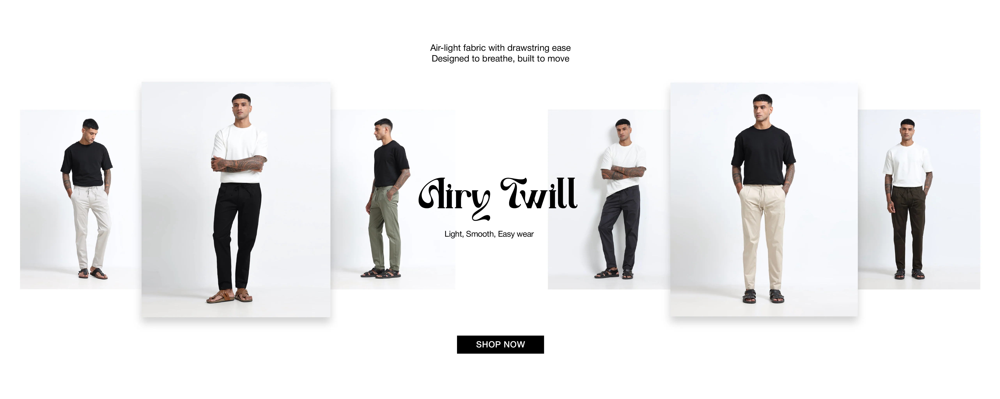

# How to Style New Arrivals Men’s Clothing 2026: Baggy Jeans, Cargo Pants & Streetwear Guide | Rockstar Jeans

## Introduction

Men’s fashion in 2026 is evolving toward comfort-driven streetwear, oversized silhouettes, and relaxed fits. The rise of **new arrivals men's clothing 2026** shows a clear shift from tight, restrictive outfits to breathable and versatile styles. Today, fashion is not just about looking good—it’s about feeling comfortable while staying modern.

From **latest baggy jeans for men** to **men's cargo pants streetwear**, the new generation of outfits focuses on everyday usability, styling flexibility, and urban aesthetics. Rockstar Jeans brings this modern streetwear identity into practical, wearable fashion.

---

## Quick Overview

Modern men’s fashion in 2026 is defined by baggy jeans, relaxed-fit denim, oversized tees, and cargo pants. These styles are popular because they offer comfort, mobility, and streetwear appeal, making them ideal for daily wear, travel, and casual outings.

---

## Key Fashion Trends in 2026

- Baggy and relaxed-fit denim dominating streetwear
- Cargo pants making a strong comeback
- Oversized t-shirts replacing slim fits
- Neutral and earthy tones trending in menswear
- Comfort-first fashion becoming mainstream

---

## What is New Arrivals Men's Clothing 2026?

**New arrivals men's clothing 2026** refers to the latest fashion drops focusing on modern silhouettes, breathable fabrics, and streetwear-inspired designs. These collections include relaxed denim, oversized tops, cargos, and everyday casual wear.

The main goal is to combine style with comfort, making outfits suitable for work, travel, and lifestyle use.

---

## Latest Baggy Jeans for Men: Why They Are Trending

The demand for **latest baggy jeans for men** has increased due to their comfort and versatility.

### Benefits:
- Maximum comfort for daily wear
- Easy styling with oversized tees
- Strong streetwear aesthetic
- Suitable for all body types
- Works for casual and semi-street outfits

Baggy jeans are now a core part of modern **new arrival streetwear collection** drops.

---

## Men’s Cargo Pants Streetwear Evolution

**Men's cargo pants streetwear** has become a key trend in 2026 due to its utility-inspired design and relaxed fit.

### Why cargos are popular:
- Multiple pockets for utility fashion
- Relaxed silhouette for comfort
- Perfect for streetwear styling
- Works with sneakers and oversized tops

---

## Relaxed Fit Denim Jeans for Daily Wear

**Relaxed fit denim jeans** are designed for all-day comfort without sacrificing style. Unlike slim jeans, they offer extra room in the thigh and leg area.

### Best for:
- Office casual wear
- College outfits
- Travel comfort
- Daily streetwear looks

---

## Oversized Streetwear Outfits with Baggy Jeans

The trend of **oversized streetwear outfits with baggy jeans** is dominating 2026 fashion.

### Styling ideas:
- Baggy jeans + oversized t-shirt + sneakers
- Cargo pants + graphic tee + cap
- Relaxed denim + hoodie for layered look

This style reflects modern urban youth culture and comfort-first fashion.

---

## Where to Buy Latest Baggy Jeans for Men Online

If you are searching for **where to buy latest baggy jeans for men online**, look for brands that focus on:

- Premium denim quality
- Relaxed and oversized fits
- Streetwear-inspired collections
- Durable stitching and comfort

Rockstar Jeans focuses on modern streetwear essentials designed for everyday use.

---

## Best Relaxed Fit Denim Jeans for Daily Wear

The **best relaxed fit denim jeans for daily wear** offer a balance between comfort and structure.

### Ideal features:
- Soft breathable denim
- Straight or relaxed cut
- Neutral shades (blue, black, grey)
- Stretch-friendly fabric

---

## Trending Men's Cargo Pants Streetwear Styles 2026

Top cargo styles in 2026 include:

- Baggy utility cargos
- Slim-relaxed hybrid cargos
- Multi-pocket street cargos
- Neutral tone cargos (olive, beige, black)

---

## New Arrival Streetwear Collection Must-Haves

A strong **new arrival streetwear collection** includes:

- Baggy jeans
- Relaxed denim
- Cargo pants
- Oversized t-shirts
- Graphic tees
- Street jackets

---

## Conclusion

The future of men’s fashion is clearly shifting toward comfort, flexibility, and streetwear identity. Whether it’s **new arrivals men's clothing 2026**, **latest baggy jeans for men**, or **men's cargo pants streetwear**, the focus remains on relaxed fits and modern styling.

Rockstar Jeans continues to define this evolution with fashion that blends comfort, durability, and street-ready aesthetics.

---

## Keywords Used
- new arrivals men's clothing 2026
- latest baggy jeans for men
- men's streetwear fashion 2026
- relaxed fit denim jeans
- men's cargo pants streetwear
- new arrival streetwear collection
- where to buy latest baggy jeans for men online
- best relaxed fit denim jeans for daily wear
- trending men's cargo pants streetwear styles 2026
- oversized streetwear outfits with baggy jeans

## Blog
https://www.rockstarjeans.com/blogs/news/new-arrivals-mens-clothing-2026-latest-baggy-jeans-cargos-streetwear-rockstar-jeans
