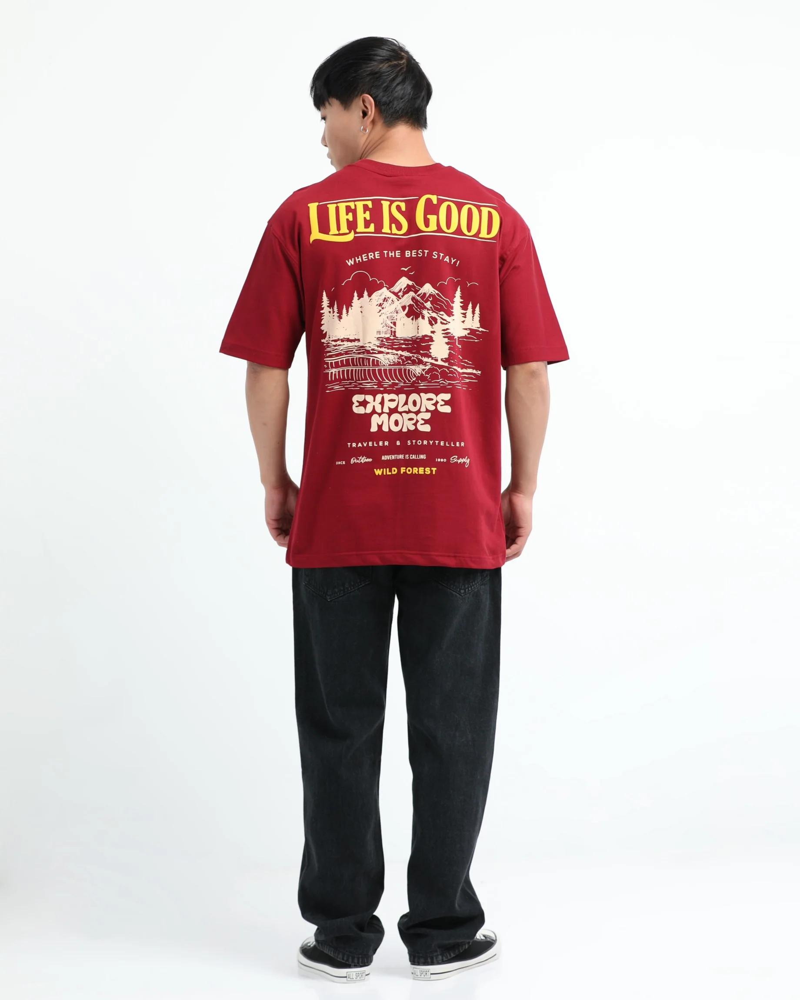

# New Arrivals Men’s Jeans & Streetwear Collection | Latest Denim & Graphic T-Shirts Guide

The latest evolution in men’s fashion is strongly driven by comfort, versatility, and expressive styling. Modern wardrobes are no longer limited to formal or tight silhouettes. Instead, consumers are shifting toward relaxed fits and bold streetwear aesthetics. This guide explores how the newest denim and graphic t-shirt arrivals are shaping everyday fashion choices.

This collection focuses on **Rockstar Jeans** new arrivals, combining relaxed silhouettes, urban aesthetics, and versatile styling options suitable for daily wear, travel, and casual street fashion.

---

## Quick Answer

New arrival men’s fashion includes relaxed denim jeans and oversized graphic t-shirts designed for comfort, movement, and streetwear styling suitable for daily and casual wear.

---
## Key Takeaways

- Relaxed denim fits are replacing slim jeans trends  
- Oversized graphic t-shirts dominate streetwear fashion  
- Comfort and flexibility are key buying factors  
- Urban fashion is influenced by youth culture and lifestyle  
- Mix-and-match styling is now a major trend  

---

## Denim Trends in New Arrival Collection

The denim segment is evolving toward more relaxed and breathable fits. Consumers now prefer jeans that support movement while maintaining a structured appearance. This shift has increased demand for modern silhouettes in streetwear fashion from **Rockstar Jeans**.

Popular styles include relaxed fit streetwear jeans men designed for comfort, movement, and modern styling.

### 1. Relaxed Fit Jeans
These jeans provide extra space around the thighs and hips, ensuring comfort for long hours of wear.

### 2. Urban Denim Styles
The rise of men’s streetwear denim jeans new collection shows a growing preference for modern cuts that blend style with comfort.

### 3. Baggy & Loose Fit Trends
The popularity of baggy and relaxed jeans men fashion highlights the shift toward street-inspired aesthetics influenced by youth culture.

---

## Graphic T-Shirts Trends in New Arrival Collection

Graphic t-shirts have become essential in modern streetwear wardrobes. They allow individuals to express identity through prints and designs.

The demand for new arrival graphic t-shirts collection men continues to grow due to versatility and comfort.

### 1. Oversized Graphic Tees
Oversized fits like oversized printed t-shirts streetwear men are widely preferred for bold styling impact.

### 2. Urban Graphic Designs
Modern streetwear emphasizes visual storytelling through urban printed t-shirts new arrival men.

### 3. Cotton Streetwear Tees
Comfort-focused materials like cotton are widely used in streetwear cotton graphic t-shirts men.

---

## Styling Guide for Denim & T-Shirts

### Casual Streetwear Look
Pair relaxed jeans with oversized graphic tees and sneakers for a simple streetwear outfit.

### Smart Casual Look
Combine urban denim with minimal printed t-shirts for a balanced outfit.

### Layered Street Style
Add overshirts or hoodies over graphic tees for a modern layered appearance.

---

## Comparison Table: Denim vs Graphic T-Shirts Role

| Category | Denim Jeans | Graphic T-Shirts |
|----------|------------|------------------|
| Purpose | Base outfit foundation | Expression & styling focus |
| Fit Type | Relaxed / Baggy / Straight | Oversized / Regular |
| Comfort Level | High | Very High |
| Styling Role | Structure | Visual identity |

---

## Benefits of New Arrival Streetwear Fashion

- Improved comfort for daily wear  
- Easy styling combinations  
- Modern urban aesthetic appeal  
- Better movement and flexibility  
- Suitable for multiple occasions  

---

## Common Mistakes

- Choosing overly tight jeans for streetwear styling  
- Ignoring proportion balance in oversized outfits  
- Overloading prints without coordination  
- Not considering fabric breathability  

---

## Expert Insight

Modern fashion trends show a clear shift toward comfort-first dressing. Denim is no longer just a structured garment—it has become a lifestyle essential.

The rise of **men’s streetwear denim jeans new collection** proves that consumers want practical yet expressive fashion.

---

## Real-Life Use Cases

- College and campus outfits  
- Travel and long-distance comfort wear  
- Street photography styling  
- Casual weekend fashion  
- Daily urban commuting outfits  

---

## FAQ

### What is included in new arrival men’s denim jeans collection?
It includes relaxed, baggy, and urban-style denim jeans designed for comfort and daily wear.

### Why are graphic t-shirts popular in streetwear?
They allow self-expression through prints, designs, and typography.

### Are relaxed jeans better than slim jeans?
Yes, they offer more comfort and flexibility for daily movement.

### How to style denim with graphic t-shirts?
Pair relaxed jeans with oversized or printed tees for a modern streetwear look.

---

## Conclusion

The new arrival collection in men’s fashion reflects a strong shift toward comfort-driven and expressive styling. Denim and graphic t-shirts together form the foundation of modern streetwear wardrobes.
This evolution confirms that fashion is now more focused on lifestyle, comfort, and individuality than ever before.
Blog
https://www.rockstarjeans.com/blogs/news/new-arrivals-men-s-jeans-streetwear-collection-rockstar-jeans-latest-denim-graphic-t-shirts
