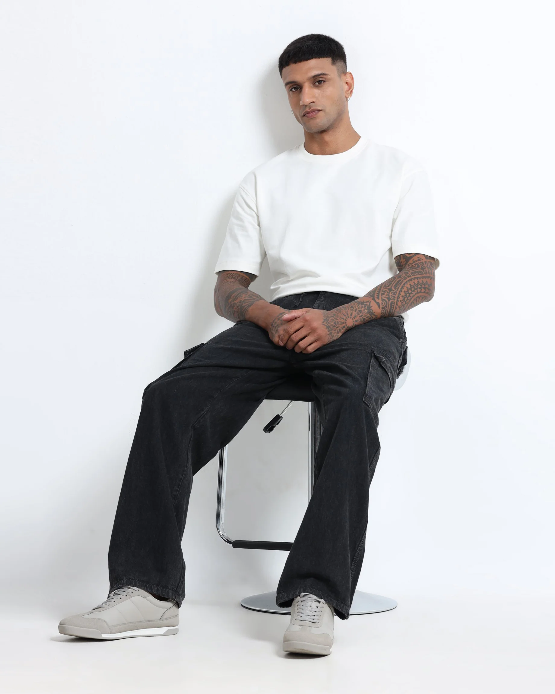

# Best Baggy Cargo Jeans for Men in 2026: Streetwear Comfort Meets Utility Fashion

Streetwear fashion in India is evolving rapidly, and oversized silhouettes are becoming one of the biggest menswear trends in 2026. More shoppers are now searching for the best baggy cargo jeans for men because relaxed fits offer better comfort, movement, and styling versatility compared to restrictive slim-fit denim.

Modern streetwear is no longer only about appearance. Consumers now prioritize breathable fabrics, practical utility styling, and comfortable silhouettes that work for daily wear, travel, and casual outfits.

## Why Baggy Cargo Jeans Are Trending in India

The rise of baggy cargo jeans India searches reflects the growing demand for relaxed streetwear fashion. Oversized cargo denim combines utility-inspired styling with wearable comfort, making it ideal for modern urban outfits.

Unlike skinny denim, relaxed cargo silhouettes provide:

* Better movement flexibility
* Improved airflow
* Comfortable daily wear
* Utility pocket functionality
* Easier streetwear styling

This balance between fashion and practicality is one reason oversized cargo denim continues growing in popularity across India.

## What Makes Oversized Cargo Denim Comfortable?

One major advantage of oversized cargo denim is the relaxed structure around the thighs and knees. Wider silhouettes reduce stiffness during movement and feel more breathable during long hours of wear.

Most modern cargo denim styles now use medium-weight washed fabric that maintains structure while improving comfort. This makes them suitable for Indian weather conditions and everyday use.

For shoppers looking for comfortable cargo denim for daily wear, relaxed utility denim offers a better alternative to narrow tapered jeans.

## Utility Cargo Jeans and Modern Streetwear

The popularity of utility cargo jeans is strongly connected to modern streetwear trends. Oversized outfits, layered styling, and relaxed proportions now dominate casual menswear fashion.

Cargo denim works naturally with:

* Oversized T-shirts
* Hoodies
* Utility jackets
* Sneakers
* Relaxed shirts

Neutral shades like charcoal, faded blue, olive, and washed black are especially popular because they match multiple outfit combinations.

## Relaxed Cargo Denim vs Slim Fit Jeans

| Feature            | Relaxed Cargo Denim       | Slim Fit Jeans                 |
| ------------------ | ------------------------- | ------------------------------ |
| Movement           | Flexible and relaxed      | Restricted fit                 |
| Airflow            | Better ventilation        | Lower airflow                  |
| Streetwear Styling | Matches oversized trends  | Less aligned with 2026 fashion |
| Travel Comfort     | Comfortable for long wear | Can feel tight                 |
| Utility Features   | Functional cargo pockets  | Minimal utility styling        |

Because of these advantages, many consumers now prefer relaxed cargo denim for daily wear and travel styling.

## How to Style Loose Fit Cargo Jeans

Styling loose fit cargo jeans has become much easier because oversized fashion is now mainstream. Balanced streetwear styling usually works best with structured relaxed silhouettes instead of extremely oversized fits.

### Popular Outfit Ideas

1. Oversized T-shirt with relaxed cargo denim
2. Hoodie with utility-inspired jeans
3. Neutral sneakers with wide-leg silhouettes
4. Layered utility jackets with washed cargo denim
5. Minimal accessories for cleaner streetwear proportions

These combinations create modern outfits while maintaining comfort throughout the day.

## Why Wide-Leg Denim Is Growing in India

Searches for wide-leg denim for men India are increasing because buyers now focus more on comfort and practical styling instead of only fitted silhouettes.

Relaxed cargo denim works especially well for:

* College wear
* Daily commuting
* Travel outfits
* Weekend streetwear
* Casual urban fashion

The wider fit improves mobility while still maintaining a strong streetwear aesthetic.

## Best Cargo Jeans for Streetwear Outfits

The best cargo jeans for streetwear outfits usually combine:

* Structured relaxed fits
* Clean utility detailing
* Medium-weight denim
* Neutral wash finishes
* Balanced oversized proportions

Extremely oversized silhouettes may look difficult to style daily, while structured relaxed fits remain more wearable for regular use.

## Utility-Inspired Jeans for Men in 2026

Modern utility-inspired jeans for men are becoming more refined compared to older cargo styles. Newer silhouettes focus on cleaner pocket placement, wearable proportions, and practical comfort.

This shift makes utility denim easier to wear across multiple situations, including travel, casual outings, and modern streetwear styling.

## Relaxed Denim for Travel Outfits

Another reason oversized cargo denim is growing rapidly is travel comfort. Many consumers now choose relaxed denim for travel outfits because the wider structure reduces pressure during long sitting hours.

Relaxed cargo jeans feel more comfortable during:

* Flights
* Long drives
* Outdoor movement
* Weekend travel
* Daily commuting

This practicality makes them one of the most versatile denim categories in modern menswear.

## Final Thoughts

The growing popularity of the best baggy cargo jeans for men reflects the larger movement toward comfort-focused fashion and oversized streetwear styling in India.

From breathable movement and utility functionality to modern relaxed silhouettes, cargo denim continues redefining casual menswear trends in 2026. As oversized fashion evolves, relaxed utility denim is expected to remain one of the strongest categories in contemporary streetwear culture.
# Blog
https://www.rockstarjeans.com/blogs/news/best-baggy-cargo-jeans-for-men-in-india-2026-for-streetwear-comfort-and-utility-fashion
