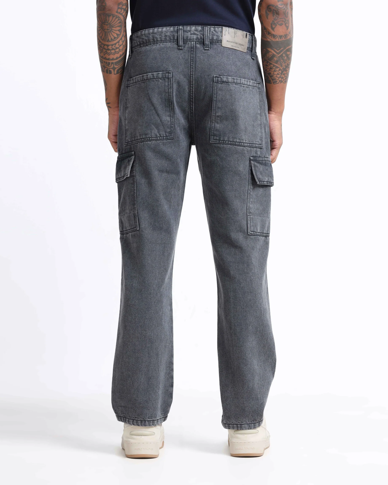

# How Should Men Style Relaxed Fit Cargo Jeans for a Streetwear Look in 2026?

Streetwear continues to evolve, but one trend remains dominant in 2026: **relaxed fit jeans for men India**. Modern streetwear is no longer about tight silhouettes. Instead, it focuses on comfort, functionality, and effortless styling. This is why cargo denim has become a popular choice among fashion-conscious men.

## Why Relaxed Fit Cargo Jeans Are Trending

The growing popularity of **best relaxed fit cargo jeans men 2026** reflects a shift toward comfortable and versatile fashion. Relaxed fits provide extra room for movement while maintaining a structured appearance that works well for everyday wear.

Unlike restrictive denim styles, relaxed cargo jeans combine practicality with a modern streetwear aesthetic.

## Cargo Denim vs Classic Denim Men India

When comparing **cargo denim vs classic denim men India**, the biggest difference is functionality.

| Feature             | Cargo Denim | Classic Denim |
| ------------------- | ----------- | ------------- |
| Utility Pockets     | Yes         | No            |
| Streetwear Appeal   | High        | Medium        |
| Everyday Comfort    | High        | High          |
| Modern Trend Value  | Very High   | Stable        |
| Styling Flexibility | Excellent   | Good          |

Cargo denim is ideal for streetwear-inspired outfits, while classic denim remains a timeless wardrobe essential.

## Best Streetwear Outfit Ideas

### 1. Oversized T-Shirt + Cargo Denim

Pair relaxed cargo jeans with an oversized t-shirt and clean sneakers. This combination creates a balanced streetwear silhouette without looking overstyled.

### 2. Charcoal Cargo Denim Look

Many shoppers search for **charcoal denim jeans men buy online** because charcoal is one of the easiest denim colours to style. Pair charcoal cargo jeans with white sneakers and a neutral hoodie for a clean urban look.

### 3. Layered Streetwear Style

Add an open overshirt or lightweight jacket over a plain t-shirt. Layering creates depth while maintaining the relaxed feel that defines modern streetwear.

## Why Charcoal Denim Is a Smart Choice

Among all denim colours, charcoal remains one of the most versatile options. It works for:

* Casual outings
* Travel outfits
* Weekend wear
* Everyday styling
* Streetwear-inspired looks

This versatility explains why **charcoal denim jeans men buy online** continues to grow as a search trend.

## Streetwear Trends in Denim Jeans for Men 2026

The biggest **denim jeans for men 2026** trends include:

* Relaxed silhouettes
* Cargo-inspired designs
* Utility styling
* Neutral colour palettes
* Comfort-focused fits

Fashion in 2026 is moving toward practical clothing that looks stylish without sacrificing comfort.

## Where to Buy Men's Jeans Online India

Consumers searching for **men's jeans online India** increasingly prefer relaxed-fit cargo denim because it combines comfort, trend appeal, and versatility. Modern cargo jeans can be styled for multiple occasions, making them a valuable wardrobe investment.

## Final Thoughts

If you're building a streetwear wardrobe in 2026, **relaxed fit jeans for men India** should be at the top of your list. From utility-inspired cargo styles to versatile charcoal denim, today's relaxed fits offer the perfect balance between fashion and comfort. Whether you prefer classic streetwear or contemporary urban styling, relaxed cargo denim remains one of the strongest fashion trends of the year.
